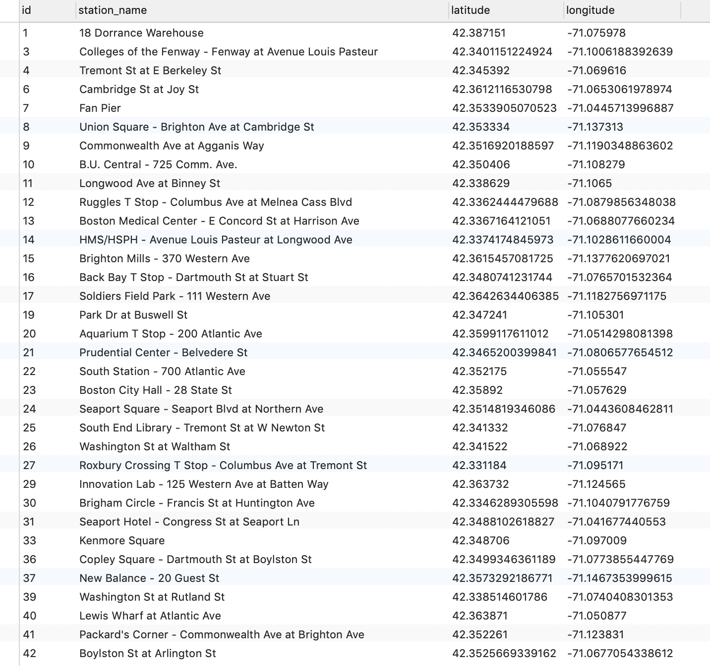
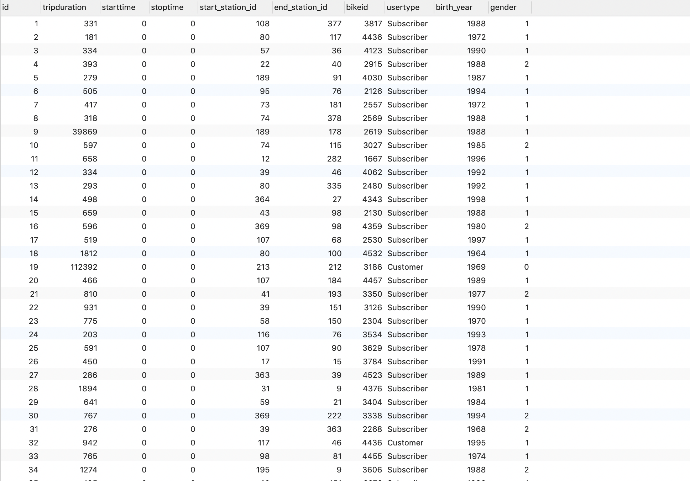

# Data_Analysis_BLUEbikes
The analysis of data gathered from BLUEBikes using Python, Numpy and Matplotlib, etc....

We used SQLite to store all information of tripdata and stations. By pre-processing, we have splitted the data into two parts - the tripdata and stations - to remove redundancy. The screenshots below are the structures of two tables for the two parts of data.

Then graphs and results are plotted and calculated.